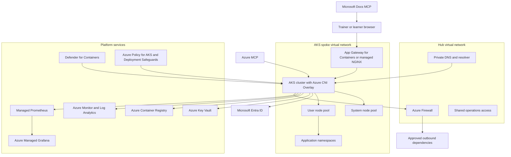

# Architecture diagram template

Adapt this Mermaid landing-zone diagram for your B.3.1 architecture evidence.

```mermaid
flowchart TB
  User[Trainer or learner browser]
  Entra[Microsoft Entra ID]
  Docs[Microsoft Docs MCP]
  AzureMCP[Azure MCP]

  subgraph Hub["Hub virtual network"]
    Firewall[Azure Firewall]
    DNS[Private DNS and resolver]
    Bastion[Shared operations access]
  end

  subgraph Spoke["AKS spoke virtual network"]
    AGC[App Gateway for Containers or managed NGINX]
    AKS[AKS cluster with Azure CNI Overlay]
    SystemPool[System node pool]
    UserPool[User node pool]
    Namespaces[Application namespaces]
  end

  subgraph Platform["Platform services"]
    ACR[Azure Container Registry]
    KV[Azure Key Vault]
    Monitor[Azure Monitor and Log Analytics]
    Prom[Managed Prometheus]
    Grafana[Azure Managed Grafana]
    Defender[Defender for Containers]
    Policy[Azure Policy for AKS and Deployment Safeguards]
  end

  User --> AGC
  AGC --> AKS
  AKS --> SystemPool
  AKS --> UserPool
  UserPool --> Namespaces
  AKS --> Entra
  AKS --> KV
  AKS --> ACR
  AKS --> Monitor
  AKS --> Prom
  Prom --> Grafana
  Defender --> AKS
  Policy --> AKS
  AKS --> Firewall
  Firewall --> Internet[Approved outbound dependencies]
  DNS --> AKS
  AzureMCP --> AKS
  Docs --> User
```
