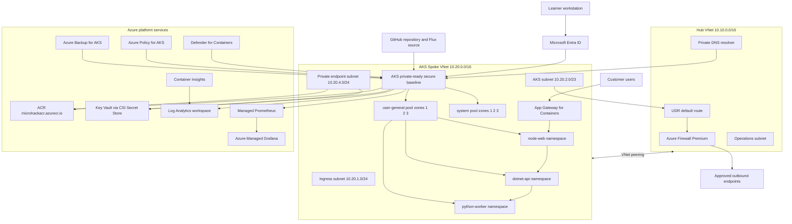

# M03 architecture diagram example

This trainer-only example shows a complete landing-zone diagram for the Module B secure-baseline design.

```mermaid
flowchart TB
  Learner[Learner workstation]
  Customer[Customer users]
  Entra[Microsoft Entra ID]
  GitHub[GitHub repository and Flux source]

  subgraph Hub["Hub VNet 10.10.0.0/16"]
    Firewall[Azure Firewall Premium]
    RouteTable[UDR default route]
    DnsResolver[Private DNS resolver]
    Ops[Operations subnet]
  end

  subgraph Spoke["AKS Spoke VNet 10.20.0.0/16"]
    IngressSubnet[Ingress subnet 10.20.1.0/24]
    AksSubnet[AKS subnet 10.20.2.0/23]
    PrivateEndpointSubnet[Private endpoint subnet 10.20.4.0/24]
    AGC[App Gateway for Containers]
    AKS[AKS private-ready secure baseline]
    SystemPool[system pool zones 1 2 3]
    UserPool[user-general pool zones 1 2 3]
    NodeWeb[node-web namespace]
    DotnetApi[dotnet-api namespace]
    PythonWorker[python-worker namespace]
  end

  subgraph Services["Azure platform services"]
    ACR[ACR microhackacr.azurecr.io]
    KeyVault[Key Vault via CSI Secret Store]
    LogAnalytics[Log Analytics workspace]
    Monitor[Container Insights]
    Prometheus[Managed Prometheus]
    Grafana[Azure Managed Grafana]
    Defender[Defender for Containers]
    Policy[Azure Policy for AKS]
    Backup[Azure Backup for AKS]
  end

  Customer --> AGC
  AGC --> NodeWeb
  NodeWeb --> DotnetApi
  DotnetApi --> PythonWorker
  Learner --> Entra
  Entra --> AKS
  GitHub --> AKS
  AKS --> SystemPool
  AKS --> UserPool
  UserPool --> NodeWeb
  UserPool --> DotnetApi
  UserPool --> PythonWorker
  AKS --> KeyVault
  AKS --> ACR
  AKS --> LogAnalytics
  AKS --> Prometheus
  Monitor --> LogAnalytics
  Prometheus --> Grafana
  Defender --> AKS
  Policy --> AKS
  Backup --> AKS
  AksSubnet --> RouteTable
  RouteTable --> Firewall
  Firewall --> Internet[Approved outbound endpoints]
  DnsResolver --> AKS
  PrivateEndpointSubnet --> ACR
  PrivateEndpointSubnet --> KeyVault
  Hub <-->|VNet peering| Spoke
```
