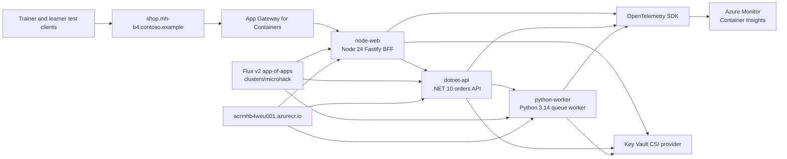
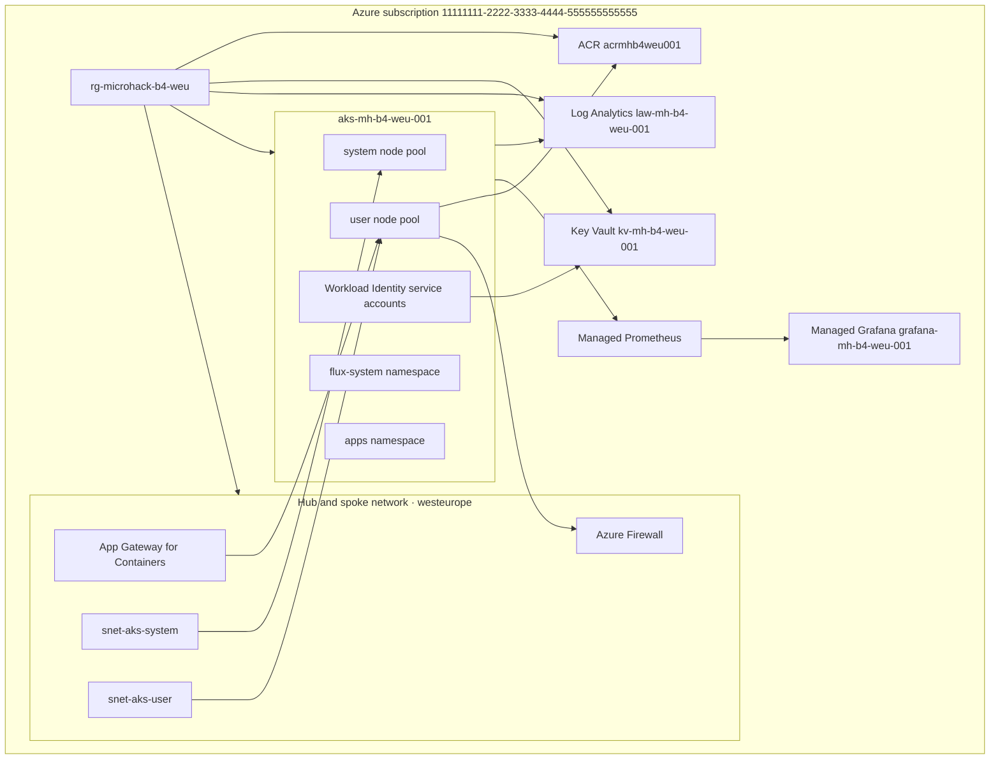
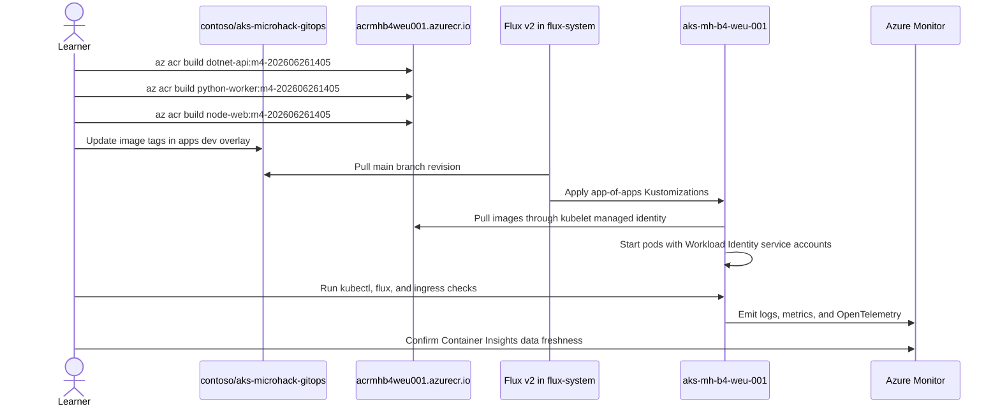

# Diagrams example

These trainer-only diagrams show a completed evidence set for Control B.4.1.

## Logical diagram

```mermaid
flowchart LR
  tester["Trainer and learner test clients"] --> dns["shop.mh-b4.contoso.example"]
  dns --> ingress["App Gateway for Containers"]
  ingress --> web["node-web\nNode 24 Fastify BFF"]
  web --> api["dotnet-api\n.NET 10 orders API"]
  api --> worker["python-worker\nPython 3.14 queue worker"]
  web --> otel["OpenTelemetry SDK"]
  api --> otel
  worker --> otel
  otel --> monitor["Azure Monitor\nContainer Insights"]
  web --> kv["Key Vault CSI provider"]
  api --> kv
  worker --> kv
  flux["Flux v2 app-of-apps\nclusters/microhack"] --> web
  flux --> api
  flux --> worker
  acr["acrmhb4weu001.azurecr.io"] --> web
  acr --> api
  acr --> worker
```

## Physical diagram

```mermaid
flowchart TB
  subgraph sub["Azure subscription 11111111-2222-3333-4444-555555555555"]
    rg["rg-microhack-b4-weu"]
    subgraph net["Hub and spoke network · westeurope"]
      fw["Azure Firewall"]
      agc["App Gateway for Containers"]
      sysSubnet["snet-aks-system"]
      userSubnet["snet-aks-user"]
    end
    subgraph aks["aks-mh-b4-weu-001"]
      sysPool["system node pool"]
      userPool["user node pool"]
      fluxNs["flux-system namespace"]
      appsNs["apps namespace"]
      wi["Workload Identity service accounts"]
    end
    acr["ACR acrmhb4weu001"]
    kv["Key Vault kv-mh-b4-weu-001"]
    law["Log Analytics law-mh-b4-weu-001"]
    prom["Managed Prometheus"]
    grafana["Managed Grafana grafana-mh-b4-weu-001"]
  end
  rg --> net
  rg --> aks
  rg --> acr
  rg --> kv
  rg --> law
  agc --> userPool
  sysSubnet --> sysPool
  userSubnet --> userPool
  userPool --> acr
  wi --> kv
  aks --> law
  aks --> prom
  prom --> grafana
  userPool --> fw
```

## Sequence diagram

```mermaid
sequenceDiagram
  actor Learner
  participant GitHub as contoso/aks-microhack-gitops
  participant ACR as acrmhb4weu001.azurecr.io
  participant Flux as Flux v2 in flux-system
  participant AKS as aks-mh-b4-weu-001
  participant Monitor as Azure Monitor
  Learner->>ACR: az acr build dotnet-api:m4-202606261405
  Learner->>ACR: az acr build python-worker:m4-202606261405
  Learner->>ACR: az acr build node-web:m4-202606261405
  Learner->>GitHub: Update image tags in apps dev overlay
  Flux->>GitHub: Pull main branch revision
  Flux->>AKS: Apply app-of-apps Kustomizations
  AKS->>ACR: Pull images through kubelet managed identity
  AKS->>AKS: Start pods with Workload Identity service accounts
  Learner->>AKS: Run kubectl, flux, and ingress checks
  AKS->>Monitor: Emit logs, metrics, and OpenTelemetry
  Learner->>Monitor: Confirm Container Insights data freshness
```
